.. examples

Examples
========

Named Color Dialog
------------------

The dialog for picking named colors within TkGridGUI was created by TkGridGUI.

The two images below show the dialog before and after a color is selected.

The objective of the dialog is to present named colors to the user for selection.

As an aid to selection, the colors can be
sorted in four different ways; by hue, luminance, hex code or color name.

Once selected, the large Label at the top of the dialog
uses the selected color as
its background and gives the name, hex value, luminance, and
contrast ratio with either white or black foreground depending on which is better.

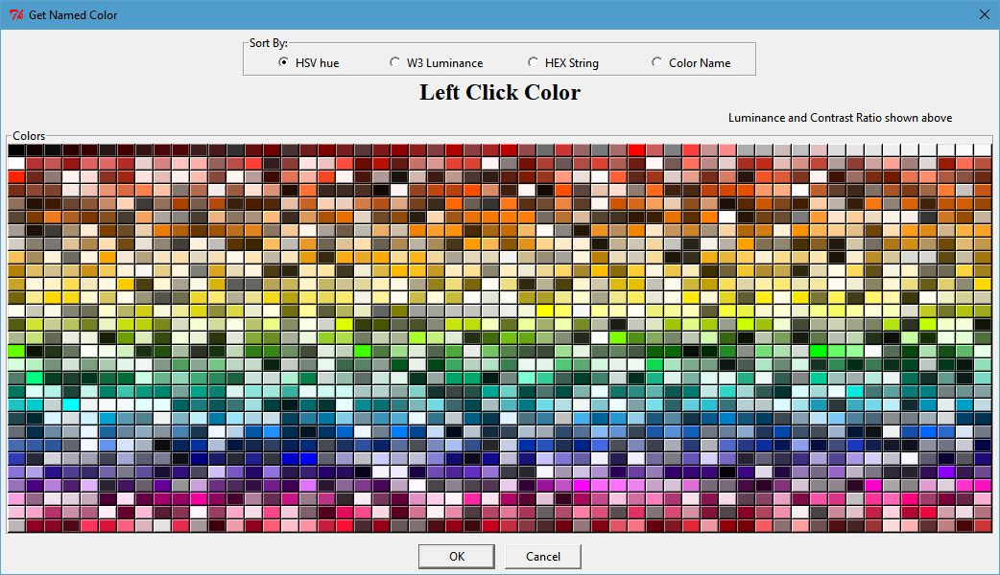

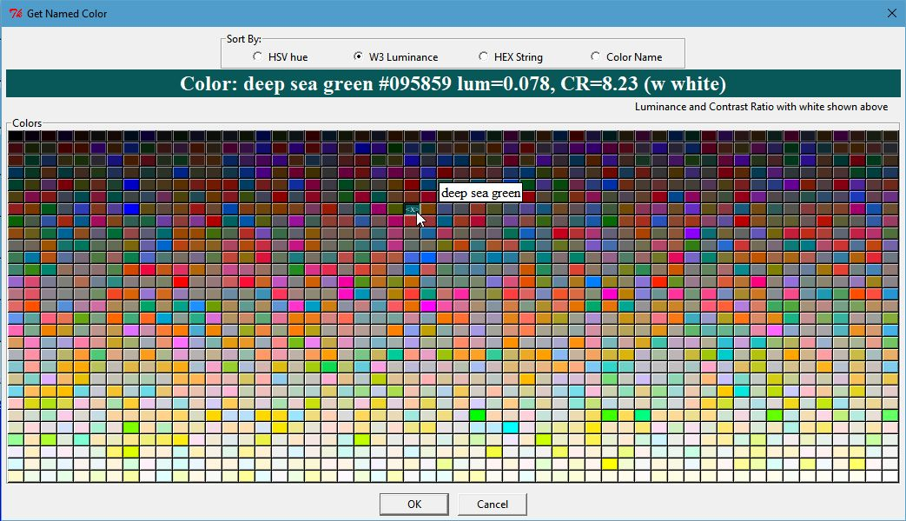
    
`Click Image to View Fill Size`

    * The names of colors are taken from `Name that Color JavaScript by Chirag Mehta <http://chir.ag/projects/ntc>`_

TkGridGUI Layout
~~~~~~~~~~~~~~~~

The TkGridGUI layout for this project is very simple, just 4 widgets on the Main tab
and two additional container tabs; an empty LabelFrame and a RadioGroup.

Each widget was selected from the listbox at the far left (labeled **Widgets**)
and placed into the grid by **Left Clicking** at each grid location ((1,1) through (4,1)).

Note that when the mouse is over a widget on the grid interface (see Label_1 at (2,1) below)
that the same widget is highlighted in the preview window 
(see the red Label_1 in the preview window below).

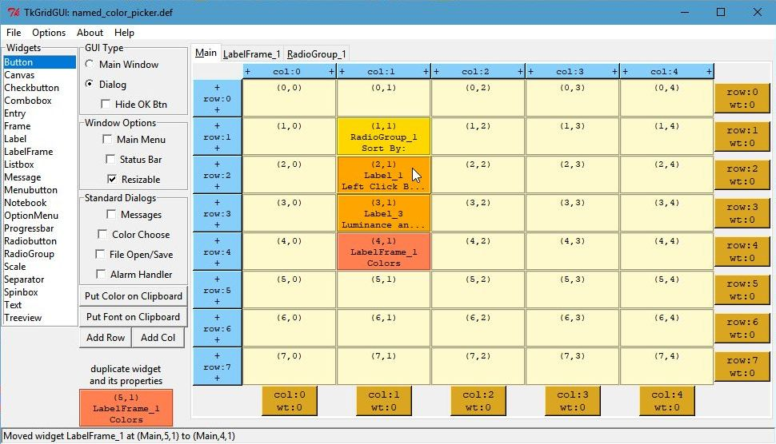

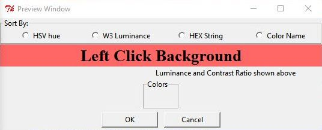
        
`Click Image to View Fill Size`

The RadioGroup tab holds **ONLY** RadioButtons by definition.
The images below show the grid layout and preview for the RadioGroup_1 tab.

Again note the mouse-over highlight feature.

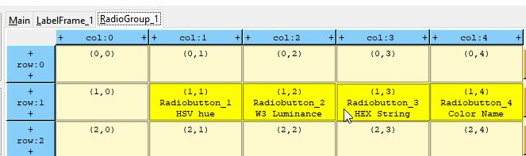

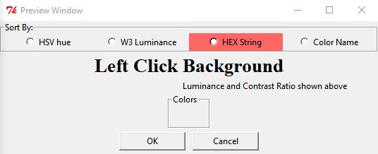

User Code
~~~~~~~~~

The empty `Colors` LabelFrame_1 is populated entirely with user code.

Each color has a Label object that has `bind` attributes to enable a mouse-over pop-up 
that shows the color's name, as well as Left Click selection.

.. code-block:: python

        # >>>>>>insert any user code below this comment for section "top_of_init"
        
        self.labelD = {} # index=(row,col): value=Label object
        row = 0
        col = 0
        for (lum, lum_p05, h, r, g, b, cstr, name) in h_sorted_colorL:
            lab = Label( self.LabelFrame_1 , text="  ", width="3", padx=0, pady=0,
                         font=("times", "6", "normal"))
            lab.grid(row=row, column=col)
            self.labelD[ (row,col) ] = lab
            lab.configure( background=cstr, relief="raised" )
            
            lab.bind("<Enter>", self.label_enter)
            lab.bind("<Leave>", self.label_leave)
            lab.bind("<ButtonRelease-1>", self.ColorPickLabel_LeftClick)

            col += 1
            if col>=COL_COUNT:
                col = 0
                row += 1

In the `validate` method, the dialog returns the user selection in the `result` dictionary.

.. code-block:: python

    def validate(self):
        self.result = {} # return a dictionary of results

        # >>>>>>insert any user code below this comment for section "dialog_validate"
        # set values in "self.result" dictionary for return

        self.result["named_color"] = self.named_selectionT

Test Dialog
~~~~~~~~~~~

Note that every dialog created by TkGridGUI automatically includes a `Testdialog` feature
that runs when the python file is run `stand-alone`.

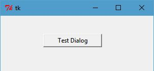

.. code-block:: python

    class _Testdialog:
        def __init__(self, master):
            frame = Frame(master, width=300, height=300)
            frame.pack()
            self.master = master
            self.x, self.y, self.w, self.h = -1,-1,-1,-1
            
            self.Button_1 = Button(text="Test Dialog", relief="raised", width="15")
            self.Button_1.place(x=84, y=36)
            self.Button_1.bind("<ButtonRelease-1>", self.Button_1_Click)

        def Button_1_Click(self, event): #click method for component ID=1
            dialog = named_color_picker(self.master, "Test Dialog")
            print( '===============Result from Dialog====================' )
            print( dialog.result )
            print( '=====================================================' )

    def main():
        root = Tk()
        app = _Testdialog(root)
        root.mainloop()

    if __name__ == '__main__':
        main()

WorkFlow
--------

For both Dialogs and Main Applications the workflow consists of::

    * Position Widget in TkGridGUI
    * Edit Widget Properties in TkGridGUI
    * Save to Generated Python File
    * In Source Code Editor, Modify User Code
    * Run Python File Stand-Alone
    * Refactor/Make Corrections
    * Repeat Cycle

While this is not a perfect implementation of
`Test Driven Development <https://en.wikipedia.org/wiki/Test-driven_development>`_ , 
it captures one of the main ideas behind TDD that development 
**relies on the repetition of a very short development cycle**.

Each change to the GUI under development can be incremental and can be tested incrementally.

Cross-Platform Font Dialog
--------------------------

The dialog for picking fonts within TkGridGUI was created by TkGridGUI.

The two images below show the dialog with a cross-platform font selected (Times) and
with a platform-specific font selected (Chiller).

The objective of the dialog is to present several cross-platform fonts to the 
user for selection using the Radiobuttons along the upper left, or any of the 
detectted system fonts in the Listbox along the upper right.  Additional attributes
of the font can be set with the Checkbutton controls labeled Bold, Italic, Underline
and Overstrike.  The font size can be selected from the numeric Listbox or set
manually in the Entry control just above that Listbox.

Once selected, the Label at the top of the dialog describes the choice
(Times 28 bold roman) and (Chiller 48 bold roman) in the examples below.

The label spanning the width of the dialog just above the OK and Cancel buttons
show the font as it displayed by a **label.configure(font=selected_font)** command.

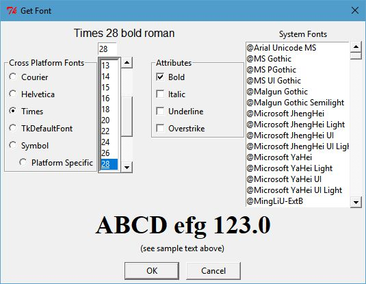

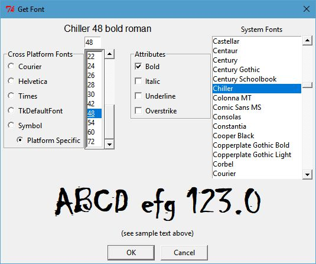
    
`Click Image to View Fill Size`

TkGridGUI Layout
~~~~~~~~~~~~~~~~

The TkGridGUI layout for this project is shown below. Many of the widgets on the Main
tab use rowspan and columnspan to achieve the desired layout (see impage marked in red 
below).

Rowspan and columnspan are applied by Right-Clicking a widget on the grid after it is 
placed and entering the desired integer value for the number of rows or columns to be
spanned.

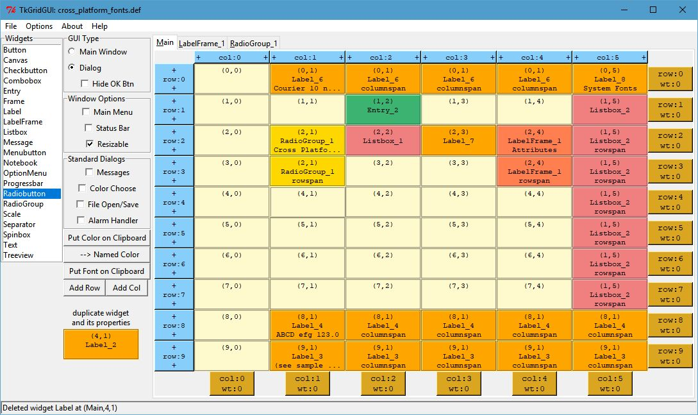

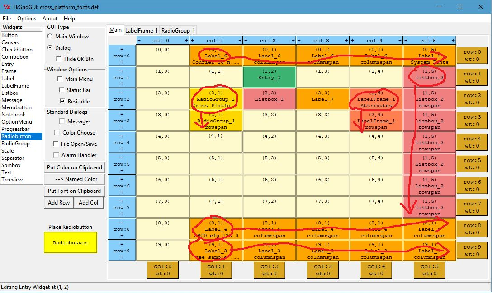

RadioGroup_1 holds the Cross-Platform Font selections and is designed as shown below.

Note that when the mouse is over a widget on the grid interface 
(see Radiobutton at (2,0) below)
that the same widget is highlighted in the preview window 
(see the red Helvetica Radiobutton in the preview window below).

The Checkbuttons are placed into LabelFrame_1 for the font Attributes in a very similar
manner.

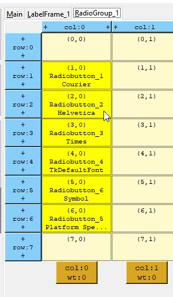

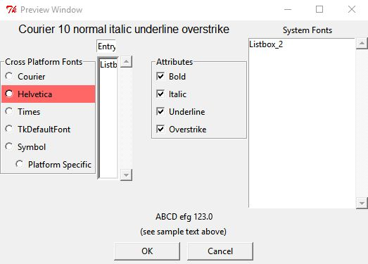

User Code
~~~~~~~~~

User code is inserted below the **# >>>>>>insert any user code** comment lines
in each of the generated methods.

For example, some initialization was done in the fonts dialog to set the default font to
Helvetica size 10.

.. code-block:: python

        # >>>>>>insert any user code below this comment for section "top_of_init"

        self.RadioGroup_1_StringVar.set("2") # make Helvetica the default
        self.current_font_name = 'Helvetica'
        self.Entry_2_StringVar.set( '10' )

In the `validate` method, the dialog returns the user selection in the `result` dictionary.

The selected font is returned both in string form and in tuple form.

.. code-block:: python

    def validate(self):
        self.result = {} # return a dictionary of results

        # >>>>>>insert any user code below this comment for section "dialog_validate"
        
        t = self.full_font_desc
        self.result["full_font_desc"] = t # return the tuple
        self.result["full_font_str"] = t[0].replace(' ','\ ') + ' %i '%t[1] + ' '.join(t[2:])
        
        return 1

Test Dialog
~~~~~~~~~~~

Note that every dialog created by TkGridGUI automatically includes a `Testdialog` feature
that runs when the python file is run `stand-alone`.

WorkFlow
--------

The workflow for the font dialog is exactly the same as it was for the 
named color dialog above and
consists of::

    * Position Widget in TkGridGUI
    * Edit Widget Properties in TkGridGUI
    * Save to Generated Python File
    * In Source Code Editor, Modify User Code
    * Run Python File Stand-Alone
    * Refactor/Make Corrections
    * Repeat Cycle

