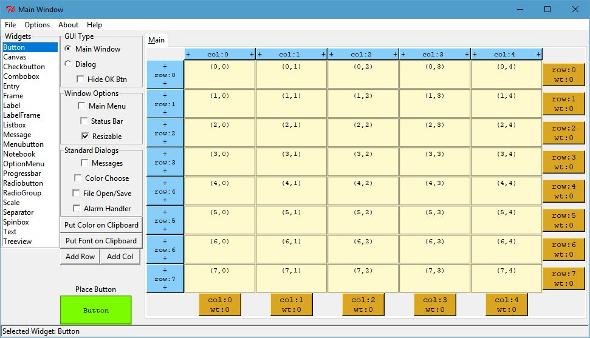
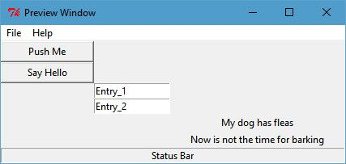
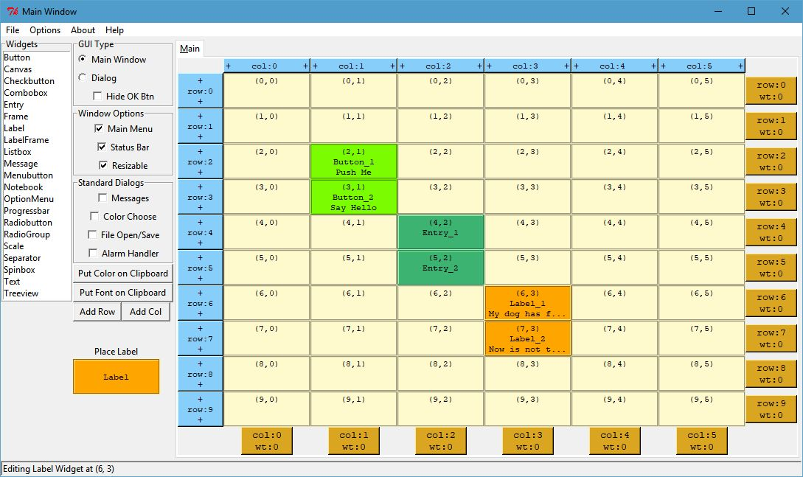
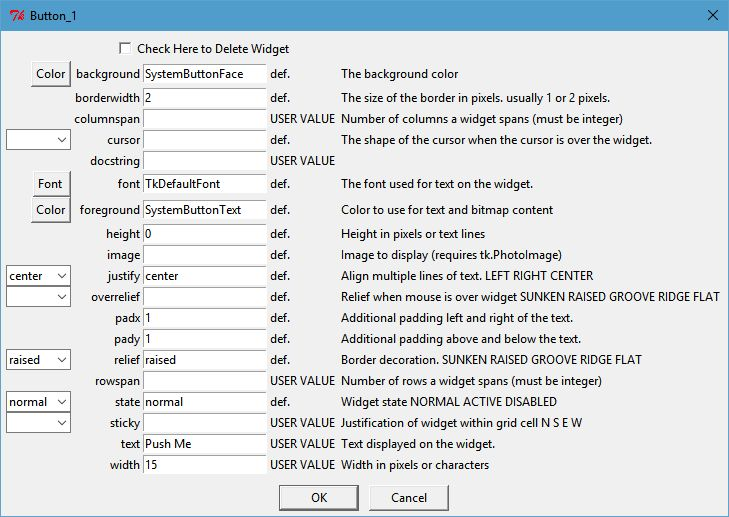
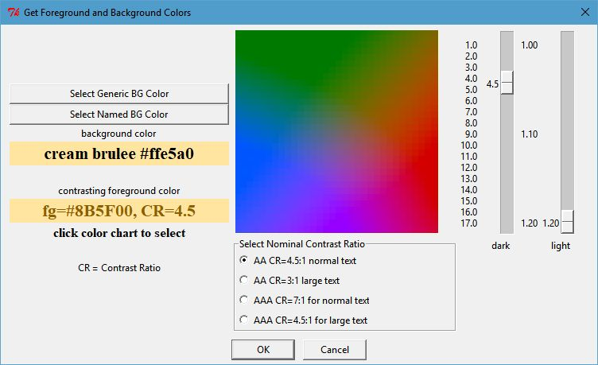

.. quickstart

QuickStart
==========

Install TkGridGUI
-----------------

The easiest way to install TkGridGUI is::

    pip install tkgridgui
    
        OR on Linux
    sudo pip install tkgridgui
        OR perhaps
    pip install --user tkgridgui

.. _internal_source_install:

Installation From Source
------------------------

Much less common, but if installing from source, then
the best way to install tkgridgui is still ``pip``.

After navigating to the directory holding TkGridGUI source code, do the following::

    cd full/path/to/tkgridgui
    pip install -e .
    
        OR on Linux
    sudo pip install -e .
        OR perhaps
    pip install --user -e .
    
This will execute the local ``setup.py`` file and insure that the pip-specific commands in ``setup.py`` are run.

Verify tkinter
--------------

**In Theory** tkinter is included with all standard Python distributions.
(In practice, it might not be included.)
It's almost certainly there on a Windows machine, however,
on Linux you might have to try::

    sudo apt-get update
    sudo apt-get install python-tk
    sudo apt-get install python3-tk
    
In order to get Tkinter/tkinter for python 2 & 3.

You can test the installation from a terminal window with::

    >>> import Tkinter       # python2
    >>> Tkinter._test()      # python2
    
    >>> import tkinter       # python3
    >>> tkinter._test()      # python3

This should pop up a small test window.

Running TkGridGUI
-----------------

After installing with ``pip`` a launch command line program called **tkgridgui** or, 
on Windows, **tkgridgui.exe** will be in your machine's system path.

Simply typing::

    tkgridgui

will run TkGridGUI.

If not, then there may be an issue with your system path.
The path for the tkgridgui executable might be something like::

    /usr/local/bin/tkgridgui             (if installed with sudo pip install -e .)
         or 
    /home/<user>/.local/bin/tkgridgui    (if installed with pip install -e .)
         or 
    C:\Python27\Scripts\tkgridgui.exe    (on Windows)

Make sure your system path includes the proper path above.

Grid Notebook
-------------

When TkGridGUI launches, it presents the grid notebook shown below.
When first opened, only the "Main" tab is on the notebook, however, as container widgets
like Frames or RadioGroups are placed, their tabs will appear.

Widgets are selected from the listbox at the far left and are placed on the grid notebook with a left click.
The widget to be placed is also highlighted at the lower left (in the example below, a green Button).

If additional rows or columns are needed, they can be inserted with the "+" operators along the blue upper
and left side controls.

If weights are needed to control widget size when the main window is resized, the gold "wt" controls along
the bottom and right side can be used. (don't forget to set the ``sticky`` attribute of any widgets to be
controlled by weight).

Additional features such as Main Menu or Status Bar can be selected with the check boxes along the left.

    
`Click Image to View Fill Size`

::

    Basic Usage: 
      Select Widget in Listbox with Left Click.
      Place Widget with Left Click in grid.

    Edit Widget:
      Right Click Widget in Grid or Preview Window.

    Move Widget:
      Left Button Drag and Drop in Grid.

    Duplicate Widget: 
      Left Click Widget in Grid.
      Left Click in grid to place the duplicate.

    Insert Row or Column with Left Click on "+" control.

    Add Weight to row or column with "wt" control.

    Select Corresponding Tab for Widgets in Frames, RadioGroups etc.

Preview Window
--------------

As widgets are added, the preview window will show the current state of the widgets in the application.

    
`Click Image to View Fill Size`

Widget Attributes
-----------------

Right click on a widget either in the Preview Window or the Grid Notebook to set its properties.

The example below shows the options available for a Button widget.

Note that for Color or Font, there are pop-up dialogs to select values for color or font.

Many of the options have drop-down selections for enumerated inputs like relief, state, cursor, etc.

    
`Click Image to View Fill Size`

Contrast Ratio
--------------

For widgets with a foreground and background color, a color selection control is present that
helps select colors that comply with  WCAG 2 Contrast Ratio guidance.

Contrast Ratio WCAG 2 see: https://en.wikipedia.org/wiki/Template:Color_contrast_ratio

    
`Click Image to View Fill Size`

Save Tkinter Application
------------------------

When the GUI has been designed to your liking, or at various stages along the way, you can save
your work with the menu option File/Save. 

Two files are saved...

1) An application definition file (\*.def) that defines all the application's attributes.
2) A python source code file (\*.py) with all of the Tkinter implemented statements.

Definition File
~~~~~~~~~~~~~~~

The definition file is structured like a configuration file with the overall attributes
in the section call [app_attr] and each widget like [Button_1] etc. shown below that.::

    [app_attr]
    hideokbutton = no
    hasstddialmess = no
    add_menu_ctrl_keys = yes
    name = example
    guitype = main
    hasstdalarm = no
    menu = File\n  New\n  Open\n  Save\n\n  Exit\nHelp\n  Sounds\n    Moo\n    Meow
    resizable = yes
    hasmenu = yes
    height = 151
    width = 425
    hasstddialcolor = no
    col_weights = 
    row_weights = 
    hasstddialfile = no
    y = 55
    x = 1107
    hasstatusbar = yes

    [Button_1]
    widget_type = Button
    tab_label = Main
    row = 2
    col = 1
    rowspan = 
    text = Push Me
    docstring = 
    width = 15
    columnspan = 

    [Button_2]
    widget_type = Button
    tab_label = Main
    row = 3
    col = 1
    .
    .
    .

Python Tkinter File
~~~~~~~~~~~~~~~~~~~

The generated python code is designed to run under both python 2 and 3.

As such the import section checks for python version.

.. code-block:: python

    if sys.version_info < (3,):
        from future import standard_library
        standard_library.install_aliases()
        from ttk import Combobox, Progressbar, Separator, Treeview, Notebook
    else:
        from tkinter.ttk import Combobox, Progressbar, Separator, Treeview, Notebook

    from tkinter import *

All of the widgets are created by their own ``make`` method in order to organize the code.

.. code-block:: python

        self.make_Button_1( self.grid_frame ) #  Button: Push Me : at Main(2,1)
        self.make_Button_2( self.grid_frame ) #  Button: Say Hello : at Main(3,1)
        self.make_Entry_1( self.grid_frame )  #  Entry:  at Main(4,2)
        self.make_Entry_2( self.grid_frame )  #  Entry:  at Main(5,2)
        self.make_Label_1( self.grid_frame )  #  Label: My dog has fleas : at Main(6,3)
        self.make_Label_2( self.grid_frame )  #  Label: Now is not the time for barking : at Main(7,3)

Menu items create keyboard accelerator keys by default.

.. code-block:: python

        # use both upper and lower characters for keyboard accelerator options.
        self.master.bind("<Control-N>", lambda event: self.menu_File_New())
        self.master.bind("<Control-n>", lambda event: self.menu_File_New())
        self.master.bind("<Control-O>", lambda event: self.menu_File_Open())
        self.master.bind("<Control-o>", lambda event: self.menu_File_Open())
        self.master.bind("<Control-S>", lambda event: self.menu_File_Save())
        self.master.bind("<Control-s>", lambda event: self.menu_File_Save())
        self.master.bind("<Control-E>", lambda event: self.menu_File_Exit())
        self.master.bind("<Control-e>", lambda event: self.menu_File_Exit())

User Code Areas
~~~~~~~~~~~~~~~

In general the generated python code is intended to be augmented with user code.

That user code is protected from change at each TkGridGUI Save command by placing it in 
``protected user code`` areas.

For example, each widget's ``make`` method has an area for user code marked by comments so that save operations
do not overwrite customizations to the basic generated python code.

In the Button_1 example below, the text, width, row and column attributes will be overwritten
every time TkGridGUI saves the file.

The bind command, however, will not be overwritten because it is in the ``protected user code`` area.

.. code-block:: python

    # TkGridGUI generated code. DO NOT EDIT THE FOLLOWING. section "make_Button_1"
    def make_Button_1(self, frame):
        """      Button: Push Me : at Main(2,1)"""
        self.Button_1 = Button( frame , text="Push Me", width="15")
        self.Button_1.grid(row=2, column=1)

        # >>>>>>insert any user code below this comment for section "make_Button_1"

        self.Button_1.bind("<ButtonRelease-1>", self.Button_1_Click)

The same idea applies to the Button_1_Click method.  

When the button is clicked, the user code will
be executed and that code is protected from overwrite from TkGridGUI.

.. code-block:: python

    # TkGridGUI generated code. DO NOT EDIT THE FOLLOWING. section "Button_1_Click"
    def Button_1_Click(self, event): #bind method for component ID=Button_1
        """      Button: Push Me : at Main(2,1)"""
        
        # >>>>>>insert any user code below this comment for section "Button_1_Click"
        # replace, delete, or comment-out the following
        print( "executed method Button_1_Click" )
        self.statusMessage.set("executed method Button_1_Click")

User code is protected for the automatically generated StringVar callback routines.

Whenever the value of the `Entry_1_StringVar` changes, this method is called.

.. code-block:: python

    # TkGridGUI generated code. DO NOT EDIT THE FOLLOWING. section "Entry_1_StringVar_traceName"
    def Entry_1_StringVar_Callback(self, varName, index, mode):
        """       Entry:  at Main(4,2)"""

        # >>>>>>insert any user code below this comment for section "Entry_1_StringVar_traceName"
        # replace, delete, or comment-out the following
        print( "Entry_1_StringVar_Callback varName, index, mode",varName, index, mode )
        self.statusMessage.set("    Entry_1_StringVar = "+self.Entry_1_StringVar.get())
        print( "    new StringVar value =",self.Entry_1_StringVar.get() )

The automatically generated Menu routines also have user code areas.

Placing user menu logic in the ``protected user code`` area prevents TkGridGUI from overwriting
it on Save operations.

.. code-block:: python

    # TkGridGUI generated code. DO NOT EDIT THE FOLLOWING. section "menu_File_New"
    def menu_File_New(self):
        
        # >>>>>>insert any user code below this comment for section "menu_File_New"
        # replace, delete, or comment-out the following
        self.statusMessage.set("called menu_File_New")
        print( "called menu_File_New" )

